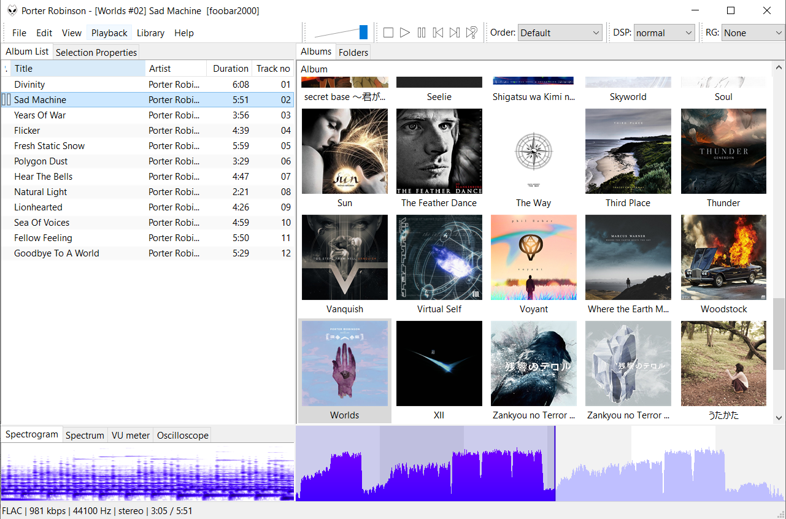

# Absolute-Waveform
A single-sided waveform seekbar for foobar2000 with subtle time markings (an alternate theme for [Waveform Seekbar](https://www.foobar2000.org/components/view/foo_wave_seekbar)).

## Usage
Click anywhere on the seekbar to move the playback to that point in the song. The waveform helps in navigating to particular parts of an audio file. The background of the waveform is subtly shaded, with white sections corresponding to odd minutes and shaded sections to even minutes, to help in navigating to particular timestamps.

Example foobar2000 layout with seekbar installed:

With "Shade Played" unchecked

With "Shade Played" checked

## Installation:

Install the waveform seekbar component by Zao, and add it as a UI element to your foobar2000 installation:
http://wiki.hydrogenaud.io/index.php?title=Foobar2000:Components_0.9/foo_wave_seekbar

Right-click on the waveform seekbar UI element and click "Configure". This should pop up:

Set the Frontend to Direct3D 9.0.
Click "Frontend Settings" and replace the code there with the contents of "absolute-waveform.fx".

### Optional, for the exact look in the screenshot:
Check "Shade played"  
Set Downmix Display to "Mix-down to mono"

For the colors seen here, I used:  
Background color – RGB(255, 255, 255)  
Foreground color - RGB(190, 190, 255)  
Highlight color  - RGB( 64,   0, 255)  
Selection color  - RGB( 52,   0, 213)
